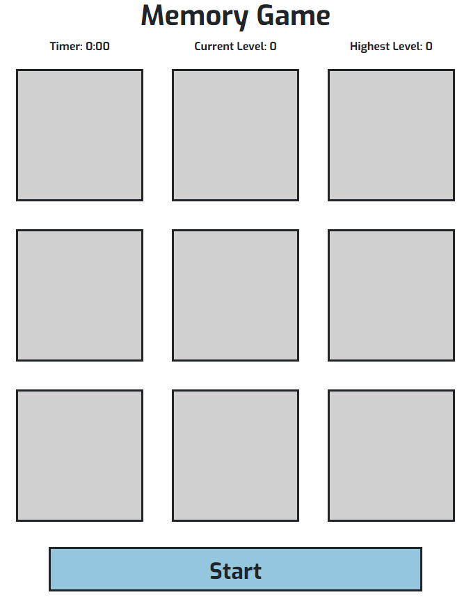
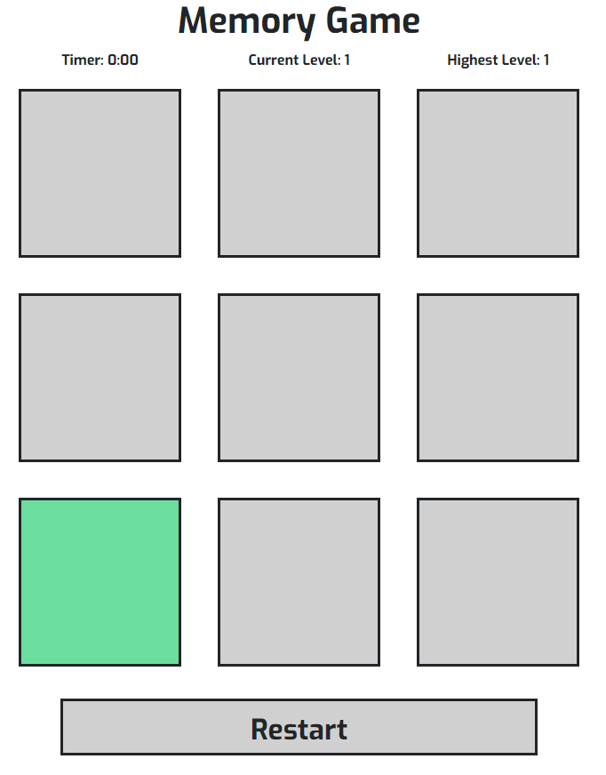
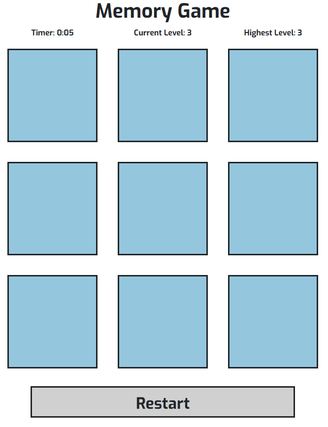
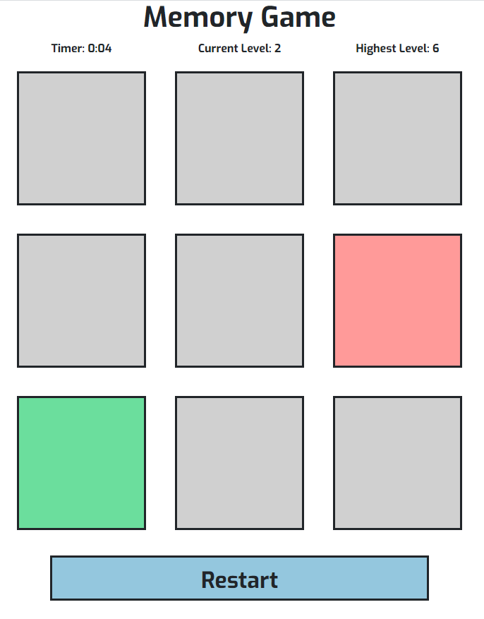

# Memory

## About
I developed a [website](https://FortyTwoFortyTwo.github.io/Memory) for Code Institute's Interactive Frontend Development Project. The website's goal is to have gameplay of Memory game.
The website is designed to be simple and easy to use on any platform or scale.

## Index – Table of Contents
* [User Experience (UX)](#user-experience) 
* [Features](#features)
* [Designs](#designs)
* [Technologies Used](#technologies-used)
* [Testing](#testing)
* [Known Bugs](#known-bugs)
* [Deployment](#deployment)

## User Experience
Only one page is made, the game and explaining how to play it.
Box color changes on events, grey as its not able to be clicked, blue as able to be clicked, green as correct box and red as incorrect box.

#### Reasons a user may visit the website
A user looking to play a memory game.

#### Reasons for the website
To play the memory game

## Features

##### Start/Restart Button
Colored blue, pressing it starts the game colored grey and renamed from "Start" to "Restart. When game ends, colored blue to restart game.

##### Memory Game
When game starts, squares will flash green to show which squares to press. If the user selects wrong, game ends with incorrect square colored red and correct square colored green

## Designs

## Technologies used
* HTML5
* CSS3
* [HTML Validator](https://validator.w3.org/) for validity of HTML
* [CSS Validator](https://jigsaw.w3.org/css-validator/) for validity of CSS
* [Bootstrap4](https://getbootstrap.com) for the grid layout, components and styling
* [Git](https://git-scm.com/) for version control.
* [GitHub](https://github.com/) for the repository to store the files.
* [GitHub Pages](https://pages.github.com/) to deploy the site.

## Testing
[HTML Validator](https://validator.w3.org/) and [CSS Validator](https://jigsaw.w3.org/css-validator/) were used to check if there any warnings or errors in HTML and CSS, which there is none.

#### Opening browser
Website can be opened by google chrone, microsoft edge and phones

#### Screen Size
Website is responsive when screen changes size to fit for any sizes above 300 pixels

#### Buttons
Buttons that starts game and selecting 9 squares all works

## Known Bugs
There are currently no known bugs

## Deployment

#### Adding and Committing files
To add files to the repository take the following steps

In the command line type -
        git add .  
        git commit -m "This is being committed"
        git push

To add all new files or modified file use " ."  - To add a single file use the pathway to the file eg .index.html  or assets/css/style.css
When committing make sure your comments are clear about what changes have been made. 
Pushing will send your work to the repository

#### Deployment 
The project was deployed with the following steps

* Logged into git hub
* Clicked the "Settings" button in the menu above the Repository.
* Scroll down the Settings page to the "GitHub Pages" Section.
* Under "Source", click the dropdown called "None" and then select "Master Branch".
* The page will automatically refresh, and a link displaced.  It may take some time for the link to show the website.
* If the page will not load go down to "template" under the "source" and select a template. 
* Scroll back down through the page to locate the now published site link in the "GitHub Pages" section.
* Website gets automatically updated on every commits push from master branch

#### Forking
By forking the GitHub Repository, you can make a copy of the original repository in your own GitHub account.  This means we can view or make changes without making the changes affecting the original.

* Log into GitHub and locate the GitHub Repository.
* At the top of the Repository there is a "Fork" button about the "Settings" button on the menu.
* You should now have a new copy of the original repository in your own GitHub account.

### Cloning
* Log into your GitHub then find the gitpod repository
* Under the repository name there is a button that says "Clone or download". Click on this button.
* If cloning with HTTPS "Clone with HTTPS", copy this link.
* Open Gitbash
* Change the current working directory to the location where you want the cloned directory to be.
* Type git clone, and then paste the URL you copied earlier.

        $ git clone https://github.com/YOUR-USERNAME/YOUR-REPOSITORY
        Press - Enter- Your local clone will be created.
        $ git clone https://github.com/YOUR-USERNAME/YOUR-REPOSITORY
                > Cloning into `CI-Clone`...
                > remote: Counting objects: 10, done.
                > remote: Compressing objects: 100% (8/8), done.
                > remove: Total 10 (delta 1), reused 10 (delta 1)
                > Unpacking objects: 100% (10/10), done.
[Click Here](https://docs.github.com/en/free-pro-team@latest/github/creating-cloning-and-archiving-repositories/cloning-a-repository) for more info on cloning. 